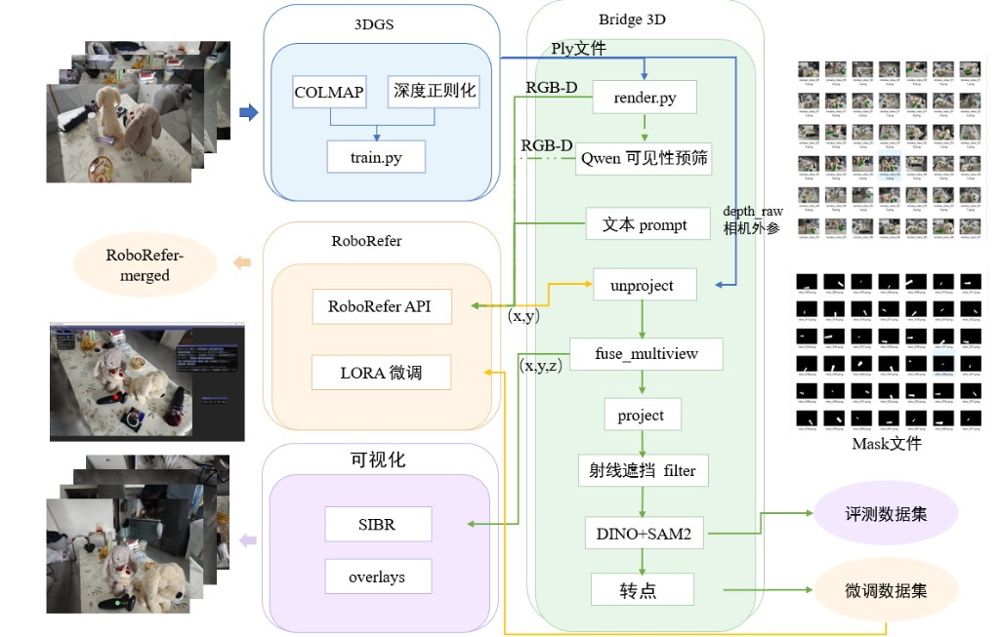
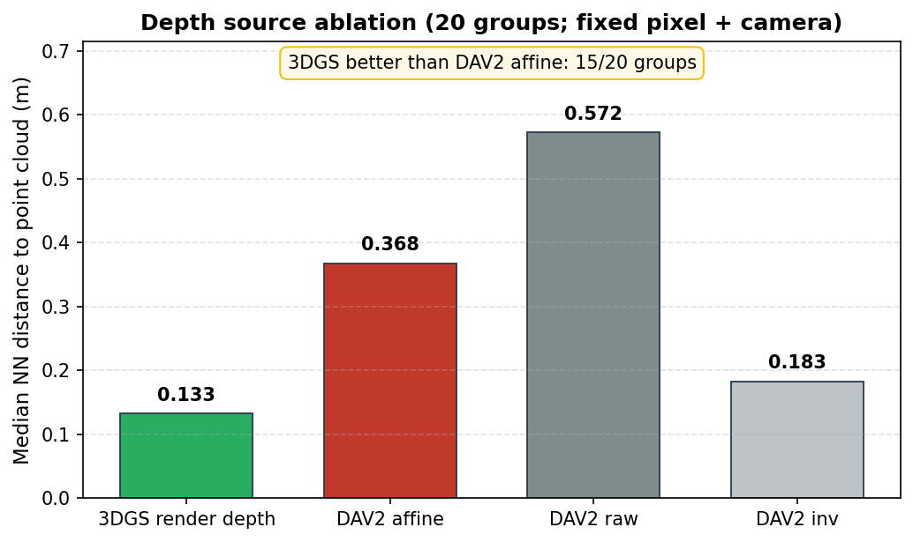
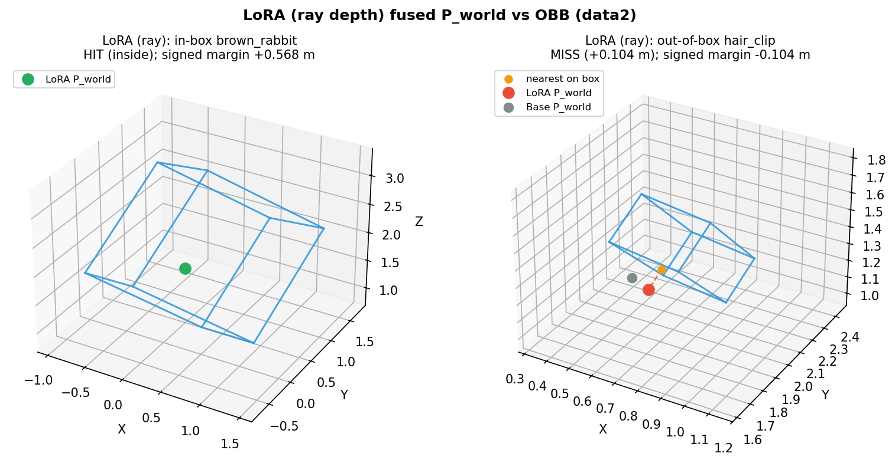
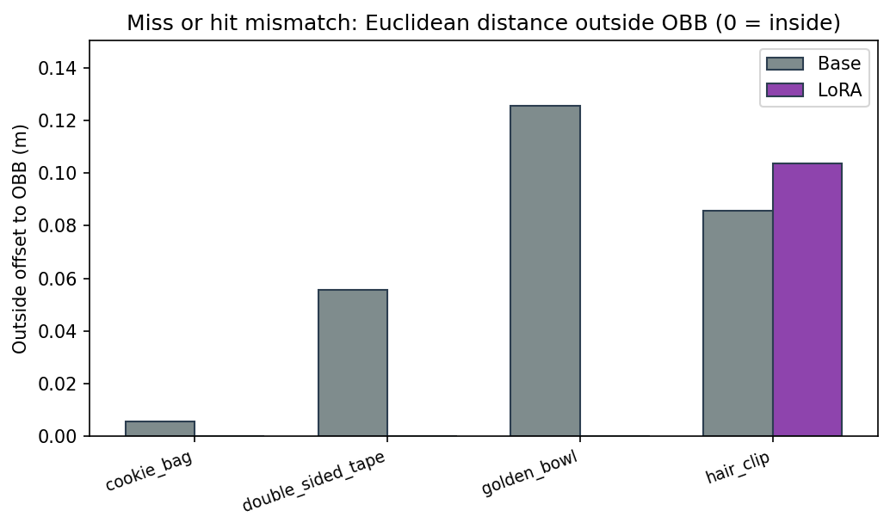
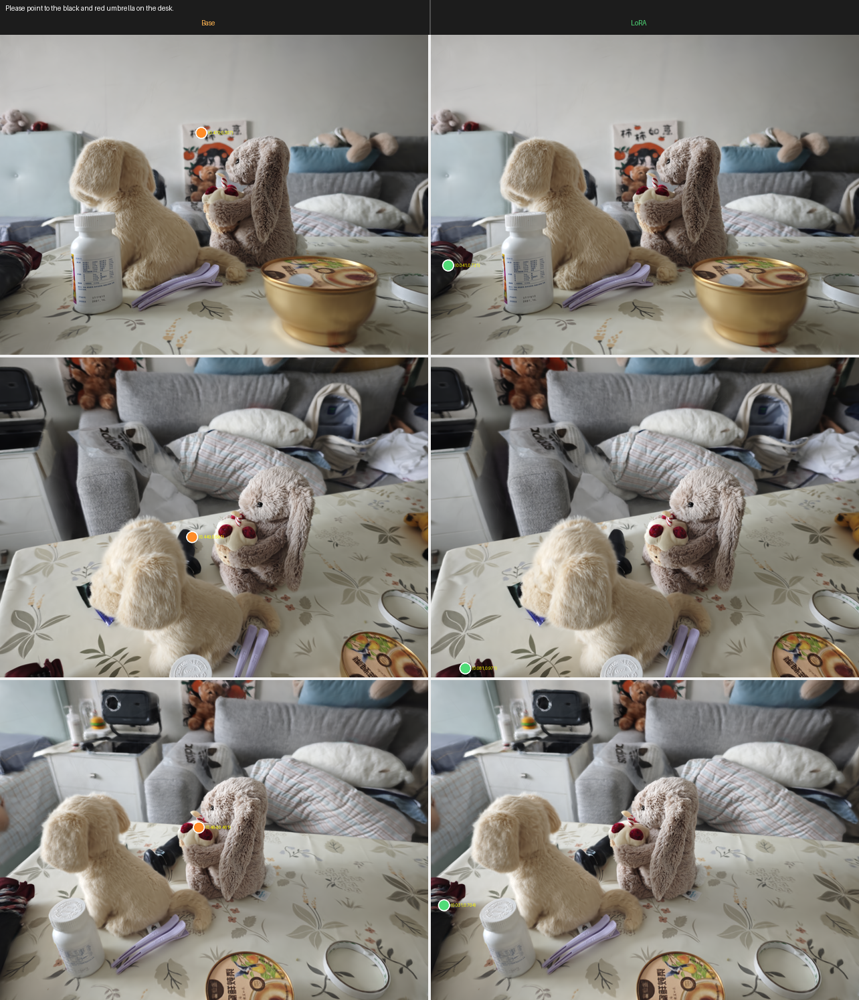
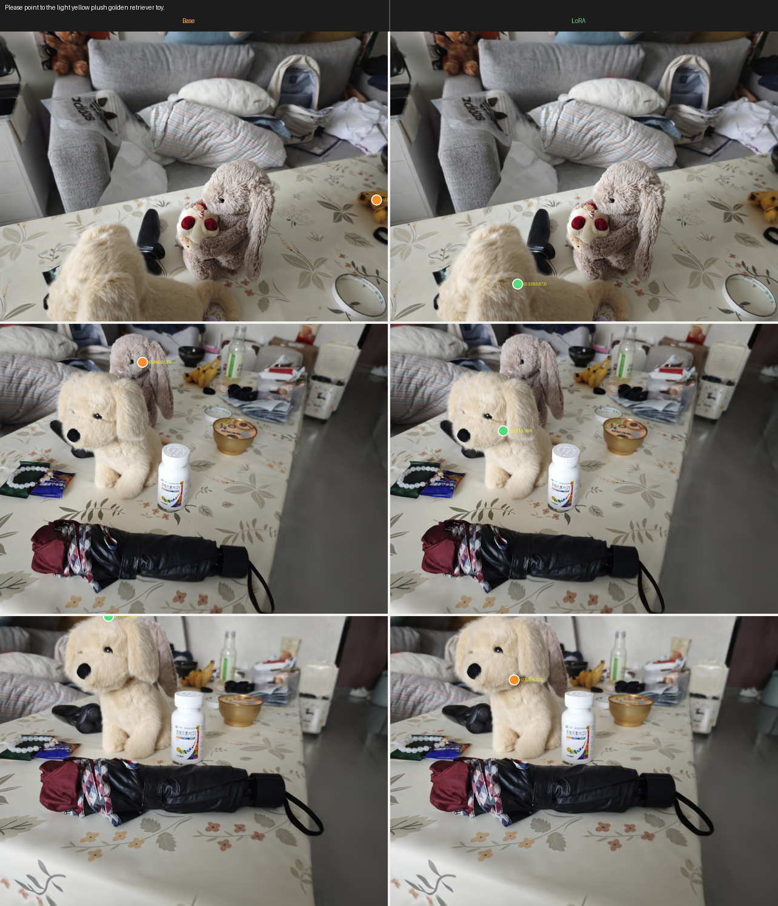
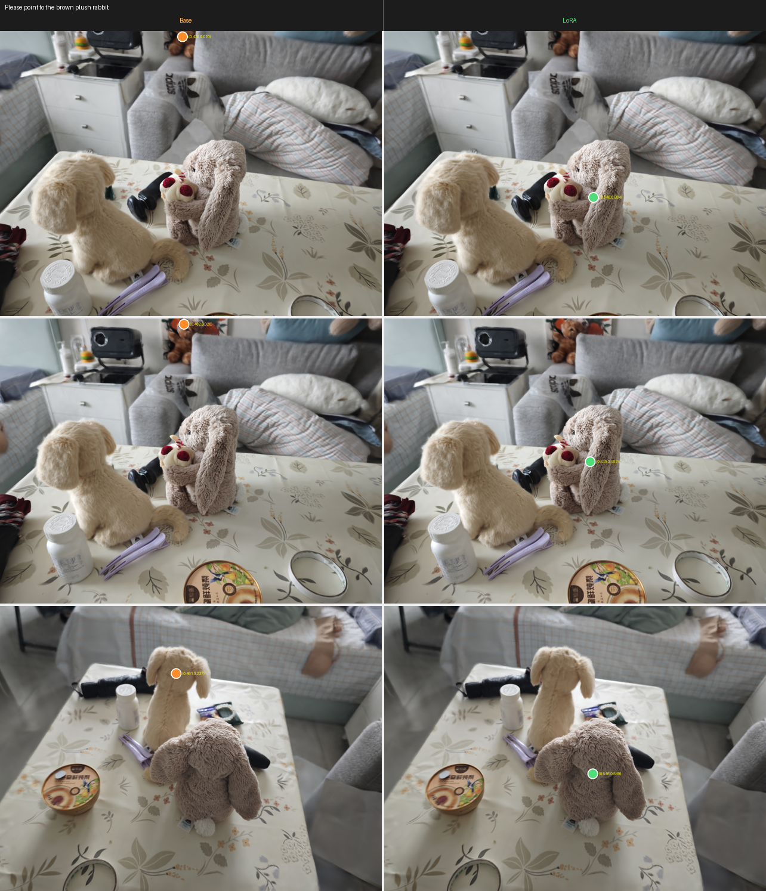
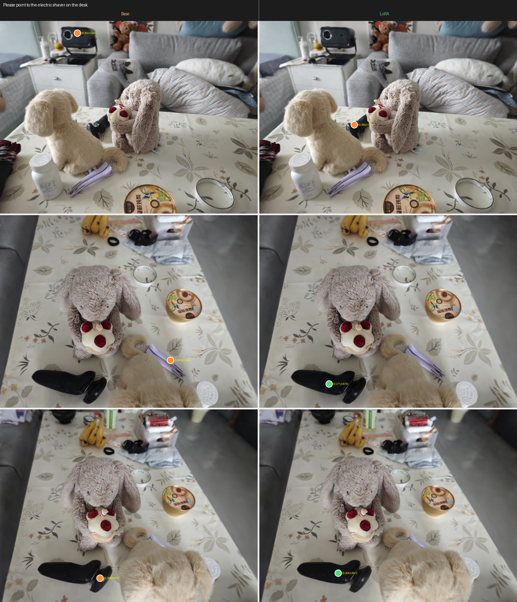
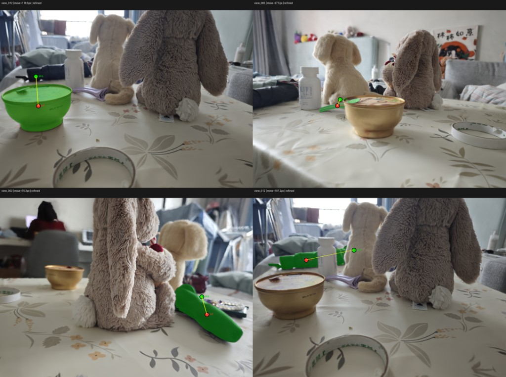

# GSrefer3D

**Language-guided 3D spatial referring**: multi-view **3D Gaussian Splatting** rendering → **RGB-D VLM** (2D point) → geometry fusion → world-space **3D anchor**.

Research integration repo — original code is mainly [`bridge/`](bridge/). Upstream [3DGS](https://github.com/graphdeco-inria/gaussian-splatting) and [RoboRefer](https://github.com/Zhoues/RoboRefer) are **cloned locally**, not vendored in full. See [docs/UPSTREAM_SETUP.md](docs/UPSTREAM_SETUP.md).

## Pipeline



**3DGS** (once per scene): multi-view photos → COLMAP + optional depth regularization → `train.py` → `point_cloud.ply`.

**Bridge 3D** — **online referring**: `render.py` (RGB-D + `depth_raw` + extrinsics) → optional visibility pre-filter → **RoboRefer API** (text → 2D) → **ray-local unproject** (`depth_mode=ray`) → **fuse_multiview** → `P_world` → **SIBR / overlays**.

Per-view 3D uses 3DGS **`depth_raw`** as initial depth **z₀**, then optional **ray refinement** ([`bridge/ray_unproject.py`](bridge/ray_unproject.py)): Gaussians near the click ray → **p75** camera depth, `z = max(z₀, z_pick)` so candidates sit on object surfaces (replaces post-fuse snap-to-vertex). Visualization markers show **inliers only** ([`visualize.py`](bridge/visualize.py), [`inject_gaussian_markers.py`](bridge/inject_gaussian_markers.py)).

**Bridge 3D** — **offline training data** (469 RGB-D Location): `P_world` → **project** → **ray occlusion filter** → **DINO + SAM2** → **2D point refinement** (mask centroid) → export → **fine-tuning dataset** → **LoRA** → merged weights → API.

Side outputs: multi-view **masks** (SAM2) and **eval** overlays vs synthetic GT.

## Results

Full per-object tables, run IDs, and resume bullets: **[`docs/RESULTS.md`](docs/RESULTS.md)** · raw JSON: [`results_2d_eval.json`](docs/results_2d_eval.json) · [`depth_compare_batch.json`](docs/depth_compare_batch.json).

### Depth for unprojection (ablation)



Same referring pixel and camera; only the **initial depth source** for z₀ changes → unproject → compare NN distance to `point_cloud.ply` (**lower is better**). This ablation does **not** include ray refinement (that step assumes a 3DGS `point_cloud.ply` and runs after z₀). Medians over **20** groups:

| Source | median NN (m) |
|--------|---------------|
| **3DGS `depth_raw`** | **0.133** |
| DAV2 affine | 0.368 |
| DAV2 raw | 0.572 |

**15/20** groups: 3DGS &lt; DAV2 affine. Raw numbers: [`depth_compare_batch.json`](docs/depth_compare_batch.json). Regenerate figure: `python bridge/plot_depth_ablation_teaser.py` (requires `matplotlib`).

### 3D OBB hit rate (manual CloudCompare OBB · data2 · 11 objects)

Hand-labeled **oriented bounding boxes** in CloudCompare (Cross Section → **Edit clipping box**) on `point_cloud.ply`, stored in [`docs/bbox_data2.json`](docs/bbox_data2.json). Metric: fused **`P_world`** inside OBB (0 margin). **Base** = `fused.json` (legacy invdepth + snap); **LoRA** = `fused_ray.json` (ray depth pull-in, same 2D predictions).

| Object | Base hit | LoRA hit | Base outside (m) | LoRA outside (m) |
|--------|:--------:|:--------:|------------------:|------------------:|
| Electric shaver | ✓ | ✓ | 0.000 | 0.000 |
| Brown rabbit | ✓ | ✓ | 0.000 | 0.000 |
| Golden retriever | ✓ | ✓ | 0.000 | 0.000 |
| Umbrella | ✓ | ✓ | 0.000 | 0.000 |
| Toy cake | ✓ | ✓ | 0.000 | 0.000 |
| Medicine bottle | ✓ | ✓ | 0.000 | 0.000 |
| Bracelet | ✓ | ✓ | 0.000 | 0.000 |
| Cookie bag | ✗ | **✓** | 0.006 | 0.000 |
| Golden bowl | ✗ | **✓** | 0.126 | 0.000 |
| Double-sided tape (hold-out) | ✗ | **✓** | 0.056 | 0.000 |
| Hair clip | ✗ | ✗ | 0.086 | 0.104 |

**Hit rate:** Base **63.6%** (7/11) · LoRA **90.9%** (10/11). JSON: [`results_3d_obb_hit.json`](docs/results_3d_obb_hit.json) · [`results_3d_obb_offset.json`](docs/results_3d_obb_offset.json).

```powershell
python bridge/eval_3d_obb_offset.py --refuse-lora-ray
python bridge/inject_obb_compare.py --all-presets
Set-Location 3DGS/gaussian-splatting/viewers/bin
.\SIBR_gaussianViewer_app.exe -m "E:\GSrefer3D\3DGS\gaussian-splatting\output\data2" --iteration obb_tape
```

**SIBR (injected Gaussians):** cyan = OBB wireframe · blue = Base `fused.json` · magenta = LoRA `fused_ray.json` ([`inject_obb_compare.py`](bridge/inject_obb_compare.py)).

```powershell
python bridge/inject_obb_compare.py --preset electric_shaver   # → iteration_obb_shaver
python bridge/inject_obb_compare.py --preset double_sided_tape  # → iteration_obb_tape
# or both GIF objects: python bridge/inject_obb_compare.py --gif-presets
```

**Electric shaver** — OBB + Base/LoRA points in SIBR (`iteration_obb_shaver`). Both models hit the hand-labeled OBB; ray LoRA point (magenta) vs Base (blue).


**Double-sided tape (hold-out)** — same scene; **Base miss** (blue outside box) · **LoRA hit** (magenta inside) after `fused_ray.json` (`iteration_obb_tape`).






**Manual OBB labeling (CloudCompare)** — segment object points, then **Edit clipping box**; copy center / dimensions / rotation into JSON (see per-object `screenshot` paths in `bbox_data2.json` → `docs/bbox_labels/` when saved locally).

### In-domain 2D vs synthetic GT (data2 · 10 objects)

LoRA (**merged data2**) **median L2 ≤ Base on all 10/10** training objects (normalized coords, same render + fuse).

| Object | Base median L2 | LoRA median L2 | Δ |
|--------|----------------|----------------|---|
| Umbrella | 0.067 | **0.011** | −0.056 |
| Golden retriever | 0.062 | **0.008** | −0.053 |
| Brown rabbit | 0.037 | **0.007** | −0.031 |
| Golden bowl | 0.009 | **0.003** | −0.006 |

See [`docs/RESULTS.md`](docs/RESULTS.md) §2 for all 10 objects, %&lt;0.05, and support.

**Base vs LoRA overlays** (3 views × 2 columns; views auto-picked for largest LoRA 2D gain vs SFT GT; green = fused inliers). Export: `python bridge/make_e2e_teaser.py --preset <name>`.

| Object | Figure |
|--------|--------|
| Umbrella |  |
| Golden retriever |  |
| Brown rabbit |  |
| Electric shaver |  |

### 3D anchor in SIBR (fused `P_world`)

After multi-view fuse, **`inject_gaussian_markers.py`** writes a red Gaussian cluster at **`P_world`** into a copy of the trained scene; **SIBR** orbit recordings show the language-guided 3D anchor on the **data2** desk scene (**LoRA** runs).

**Electric shaver** — *Please point to the electric shaver on the desk.* (run `143457_4c3b9a32`, LoRA median L2 **0.0085** vs Base **0.0273**)


**Brown plush rabbit** — *Please point to the brown plush rabbit.* (run `144845_147bac82`, LoRA median L2 **0.0065** vs Base **0.0373**)


### Double-sided tape (excluded from data2 SFT · qualitative)

**Double-sided tape — excluded from data2 SFT (469 samples); same 3DGS scene, qualitative overlay only.**


Same **data2** 3DGS scene and 72-view render pack; this object is **not** in the 469-sample `data2_location` fine-tuning set (LoRA never trained on tape labels here). Prompt: *Please point to the roll of clear double-sided adhesive tape on the desk.* **Left:** `RoboRefer-2B-SFT` (Base). **Right:** `RoboRefer-2B-SFT-data2-merged` (LoRA). Colored dots are 2D predictions / fuse inliers from `overlays_rgb` (green = fused inliers where applicable). Visual inspection suggests tighter referring after domain LoRA; **no synthetic 2D GT** for this object — see [`docs/RESULTS.md`](docs/RESULTS.md) §3 (runs `000313_6c883d56` / `132142_6c883d56`).

### Out-of-domain benchmark

| Setting | Result |
|---------|--------|
| **RefSpatial-Expand Location** | Base **50.21%** (repro.) → LoRA **45.64%** (−4.57 pp, out-of-domain) |
| **RefSpatial-Expand Placement** | Base **48.50%** → LoRA **47.00%** |

### Training data · synthetic 2D GT (mask-centroid refine)

**Training labels: 3D projection → SAM2 mask → centroid refine**



Offline pipeline for **469** RGB-D Location samples (**10** categories): fused **`P_world`** → per-view **project** → **DINO + SAM2** mask → **`make_refine_review.py`** moves the label from the projected pixel to the **mask centroid** (larger corrections shown on purpose).

| Panel | Object | `move` (px) | Note |
|-------|--------|-------------|------|
| Top-left | Golden bowl | 118.5 | Large shift onto bowl surface |
| Top-right | Hair clip | 27.5 | Smaller in-mask correction |
| Bottom-left | Electric shaver | 75.3 | Projection off body → centroid on shaver |
| Bottom-right | Umbrella | 197.2 | Largest refine; lands on umbrella region |

**Green `proj`** = 2D projection of `P_world` before refine · **Red `ref`** = SFT **`answer`** after refine · green tint = SAM2 mask. Exported via `bridge/make_refine_review.py` (`review_refine/refine_view_*.png`). Not hand-clicked coordinates.

**469** RGB-D Location samples · **10** categories · 2B LoRA 1 epoch on `data2_location` mixture.

## Repository layout (what is in Git)

| Path | In Git? | Role |
|------|---------|------|
| [`bridge/`](bridge/) | **Yes** | 2D→3D unproject, fuse, e2e, eval, training export |
| [`demo/pipeline.png`](demo/pipeline.png) | **Yes** | Pipeline figure (README) |
| [`demo/teaser_base_lora_*.png`](demo/) | **Yes** | Base vs LoRA overlay teasers (5 objects; README) |
| [`demo/teaser_train_data.png`](demo/teaser_train_data.png) | **Yes** | Training GT refine teaser (README) |
| [`demo/teaser_depth_ablation.png`](demo/teaser_depth_ablation.png) | **Yes** | Depth ablation bar chart (README) |
| [`demo/teaser_3d_electric_shaver.gif`](demo/teaser_3d_electric_shaver.gif) | **Yes** | SIBR 3D anchor — electric shaver (1718×958, ~58 MB) |
| [`demo/teaser_3d_brown_rabbit.gif`](demo/teaser_3d_brown_rabbit.gif) | **Yes** | SIBR 3D anchor — brown rabbit (1718×958, ~36 MB) |
| [`demo/teaser_obb_lora_in_out.png`](demo/) | **Yes** | OBB in-box vs out-of-box (LoRA ray; README) |
| [`demo/teaser_obb_miss_offset.png`](demo/) | **Yes** | OBB outside-offset bar chart (README) |
| [`demo/shaver.gif`](demo/shaver.gif) | **Yes** | SIBR OBB + Base/LoRA points — electric shaver (README) |
| [`demo/tap.gif`](demo/tap.gif) | **Yes** | SIBR OBB + Base/LoRA points — double-sided tape hold-out (README) |
| [`demo/teaser_3d_*.gif.orig`](demo/) | **Yes** | Explicit backup copies of the SIBR GIFs |
| `docs/` (public) | **8 files** | Setup, [`RESULTS.md`](docs/RESULTS.md), 2D/3D eval JSON, [`bbox_data2.json`](docs/bbox_data2.json), optional `bbox_labels/` screenshots |
| [`patches/`](patches/) | **Yes** | Small upstream diffs + integration notes |
| [`3DGS/render.py`](3DGS/render.py) | **Yes** | `--custom_views` RGB + `depth_raw` + cameras |
| [`3DGS/environment-envGS.yml`](3DGS/environment-envGS.yml) | **Yes** | Conda env hint |
| `3DGS/gaussian-splatting/` | **No** | Clone Inria 3DGS — [setup](docs/UPSTREAM_SETUP.md) |
| `RoboRefer-main/` | **No** | Clone RoboRefer — [patches](patches/roborefer/INTEGRATION.md) |
| `weights/`, `RoboRefer-2B-SFT/` | **No** | Download from Hugging Face |
| `training_data/`, `3DGS/test2/runs/` | **No** | Local experiments |

## Quick start

**Prerequisites:** clone 3DGS under `3DGS/gaussian-splatting/`, clone RoboRefer into `RoboRefer-main/`, download weights — see [docs/UPSTREAM_SETUP.md](docs/UPSTREAM_SETUP.md).

```powershell
# 1) envGS: multi-view render pack
cd 3DGS
python render.py -m gaussian-splatting/output/<scene> --custom_views --output_path ../test2

# 2) RoboRefer API (WSL/cloud), then from repo root:
python bridge/roborefer_client.py --root 3DGS/test2 --url http://127.0.0.1:25547 --prompt "Please point to ..."

# 3) Fuse (--ply required for default depth_mode=ray) + marker
python bridge/fuse_multiview.py --predictions 3DGS/test2/predictions.json \
  --ply 3DGS/gaussian-splatting/output/data2/point_cloud/iteration_30000/point_cloud.ply \
  --output 3DGS/test2/fused.json

# Or one-shot ( --snap picks inject-base ply; also used for ray unproject ):
python bridge/run_bridge_e2e.py --model-path 3DGS/gaussian-splatting/output/data2 --custom-views-out 3DGS/test2 --prompt "..." --snap --url http://127.0.0.1:25547
```

**2D eval vs synthetic GT:**

```bash
python bridge/eval_2d_vs_gt.py --out docs/results_2d_eval.json
```

## What we changed upstream (short)

| Upstream | Change size | Shipped in this repo |
|----------|-------------|---------------------|
| 3DGS | **Medium** — new `render.py`; small `gaussian_renderer` patch for accel | `3DGS/render.py`, `patches/3dgs/` |
| RoboRefer | **Small** — dataset register, trainer log(), API defaults, `ds_2d_*` rename | `patches/roborefer/INTEGRATION.md` only |

**Do not mirror full upstream trees on GitHub** (size, license, noise). Reviewers care about `bridge/` + reproducible setup doc.

## License

- **MIT** — `bridge/`, public `docs/` files listed above, `patches/`, `3DGS/render.py`, and project README ([LICENSE](LICENSE)).
- **Upstream** — 3DGS (Inria non-commercial research license), RoboRefer and others — see [THIRD_PARTY.md](THIRD_PARTY.md).

## Citation

If you use this integration, cite the upstream 3DGS and RoboRefer papers. This repository is a student research workspace, not an official release of either project.

## Public data files

| File | Use |
|------|-----|
| [docs/UPSTREAM_SETUP.md](docs/UPSTREAM_SETUP.md) | Clone upstream & download weights |
| [docs/RESULTS.md](docs/RESULTS.md) | Full experiment tables (English) |
| [docs/results_2d_eval.json](docs/results_2d_eval.json) | Per-object Base/LoRA 2D L2 vs GT |
| [docs/bbox_data2.json](docs/bbox_data2.json) | Manual OBB annotations (data2 · 11 objects) |
| [docs/results_3d_obb_hit.json](docs/results_3d_obb_hit.json) | 3D OBB hit rate (Base `fused.json` vs LoRA `fused_ray.json`) |
| [docs/results_3d_obb_offset.json](docs/results_3d_obb_offset.json) | OBB outside offset + Base/LoRA comparison |
| [docs/depth_compare_batch.json](docs/depth_compare_batch.json) | Depth ablation (20 groups) |
