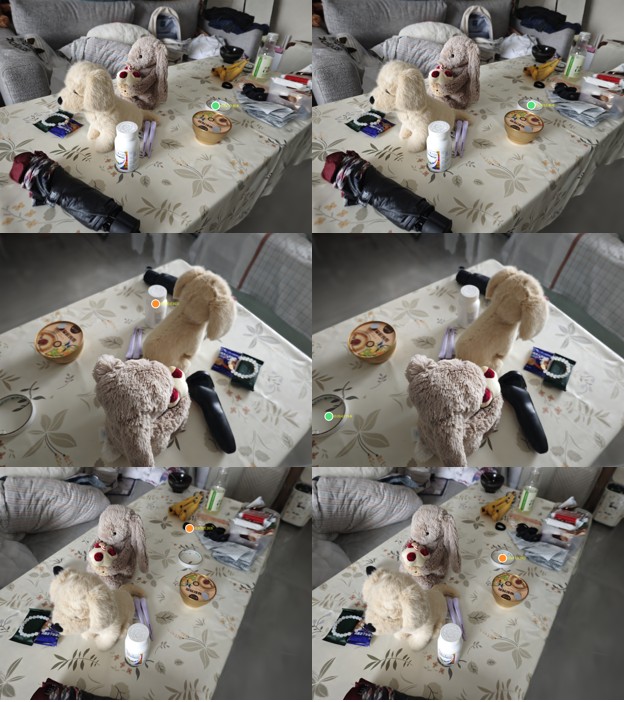

# GSrefer3D

**Language-guided 3D spatial referring**: multi-view **3D Gaussian Splatting** rendering → **RGB-D VLM** (2D point) → geometry fusion → world-space **3D anchor**.

Research integration repo — original code is mainly [`bridge/`](bridge/). Upstream [3DGS](https://github.com/graphdeco-inria/gaussian-splatting) and [RoboRefer](https://github.com/Zhoues/RoboRefer) are **cloned locally**, not vendored in full. See [docs/UPSTREAM_SETUP.md](docs/UPSTREAM_SETUP.md).

## Pipeline


**3DGS** (once per scene): multi-view photos → COLMAP + optional depth regularization → `train.py` → `point_cloud.ply`.

**Bridge 3D** — **online referring**: `render.py` (RGB-D + `depth_raw` + extrinsics) → optional visibility pre-filter → **RoboRefer API** (text → 2D) → **unproject** → **fuse_multiview** → `P_world` → **SIBR / overlays**.

**Bridge 3D** — **offline training data** (469 RGB-D Location): `P_world` → **project** → **ray occlusion filter** → **DINO + SAM2** → **2D point refinement** (mask centroid) → export → **fine-tuning dataset** → **LoRA** → merged weights → API.

Side outputs: multi-view **masks** (SAM2) and **eval** overlays vs synthetic GT.

## Results

Full per-object tables, run IDs, and resume bullets: **[`docs/RESULTS.md`](docs/RESULTS.md)** · raw JSON: [`results_2d_eval.json`](docs/results_2d_eval.json) · [`depth_compare_batch.json`](docs/depth_compare_batch.json).

### Depth for unprojection (ablation)

| Source | median NN to scene (m) |
|--------|-------------------------|
| **3DGS `depth_raw`** | **0.133** |
| DAV2 affine | 0.368 |

20 groups, fixed pixel + camera; **15/20** favor 3DGS over DAV2 affine.

### In-domain 2D vs synthetic GT (data2 · 10 objects)

LoRA (**merged data2**) **median L2 ≤ Base on all 10/10** training objects (normalized coords, same render + fuse).

| Object | Base median L2 | LoRA median L2 | Δ |
|--------|----------------|----------------|---|
| Umbrella | 0.067 | **0.011** | −0.056 |
| Golden retriever | 0.062 | **0.008** | −0.053 |
| Brown rabbit | 0.037 | **0.007** | −0.031 |
| Golden bowl | 0.009 | **0.003** | −0.006 |

See [`docs/RESULTS.md`](docs/RESULTS.md) §2 for all 10 objects, %&lt;0.05, and support.

### Double-sided tape (excluded from data2 SFT · qualitative)

**Double-sided tape — excluded from data2 SFT (469 samples); same 3DGS scene, qualitative overlay only.**



Same **data2** 3DGS scene and 72-view render pack; this object is **not** in the 469-sample `data2_location` fine-tuning set (LoRA never trained on tape labels here). Prompt: *Please point to the roll of clear double-sided adhesive tape on the desk.* **Left:** `RoboRefer-2B-SFT` (Base). **Right:** `RoboRefer-2B-SFT-data2-merged` (LoRA). Colored dots are 2D predictions / fuse inliers from `overlays_rgb` (green = fused inliers where applicable). Visual inspection suggests tighter referring after domain LoRA; **no synthetic 2D GT** for this object — see [`docs/RESULTS.md`](docs/RESULTS.md) §3 (runs `000313_6c883d56` / `132142_6c883d56`).

### Out-of-domain benchmark

| Setting | Result |
|---------|--------|
| **RefSpatial-Expand Location** | Base **50.21%** (repro.) → LoRA **45.64%** (−4.57 pp, out-of-domain) |
| **RefSpatial-Expand Placement** | Base **48.50%** → LoRA **47.00%** |

### Training data · synthetic 2D GT (mask-centroid refine)

**Training labels: 3D projection → SAM2 mask → centroid refine**


Offline pipeline for **469** RGB-D Location samples (**10** categories): fused **`P_world`** → per-view **project** → **DINO + SAM2** mask → **`make_refine_review.py`** moves the label from the projected pixel to the **mask centroid** (larger corrections shown on purpose).

| Panel | Object | `move` (px) | Note |
|-------|--------|-------------|------|
| Top-left | Golden bowl | 118.5 | Large shift onto bowl surface |
| Top-right | Hair clip | 27.5 | Smaller in-mask correction |
| Bottom-left | Electric shaver | 75.3 | Projection off body → centroid on shaver |
| Bottom-right | Umbrella | 197.2 | Largest refine; lands on umbrella region |

**Green `proj`** = 2D projection of `P_world` before refine · **Red `ref`** = SFT **`answer`** after refine · green tint = SAM2 mask. Exported via `bridge/make_refine_review.py` (`review_refine/refine_view_*.png`). Not hand-clicked coordinates.

**469** RGB-D Location samples · **10** categories · 2B LoRA 1 epoch on `data2_location` mixture.

## Repository layout (what is in Git)

| Path | In Git? | Role |
|------|---------|------|
| [`bridge/`](bridge/) | **Yes** | 2D→3D unproject, fuse, e2e, eval, training export |
| [`demo/pipeline.png`](demo/pipeline.png) | **Yes** | Pipeline figure (README) |
| [`demo/teaser_holdout_tape.png`](demo/teaser_holdout_tape.png) | **Yes** | Tape (not in data2 SFT) Base vs LoRA overlays (README) |
| [`demo/teaser_train_data.png`](demo/teaser_train_data.png) | **Yes** | Training GT refine teaser (README) |
| `docs/` (public) | **4 files** | Setup, [`RESULTS.md`](docs/RESULTS.md), depth/2D eval JSON (other notes stay local) |
| [`patches/`](patches/) | **Yes** | Small upstream diffs + integration notes |
| [`3DGS/render.py`](3DGS/render.py) | **Yes** | `--custom_views` RGB + `depth_raw` + cameras |
| [`3DGS/environment-envGS.yml`](3DGS/environment-envGS.yml) | **Yes** | Conda env hint |
| `3DGS/gaussian-splatting/` | **No** | Clone Inria 3DGS — [setup](docs/UPSTREAM_SETUP.md) |
| `RoboRefer-main/` | **No** | Clone RoboRefer — [patches](patches/roborefer/INTEGRATION.md) |
| `weights/`, `RoboRefer-2B-SFT/` | **No** | Download from Hugging Face |
| `training_data/`, `3DGS/test2/runs/` | **No** | Local experiments |

## Quick start

**Prerequisites:** clone 3DGS under `3DGS/gaussian-splatting/`, clone RoboRefer into `RoboRefer-main/`, download weights — see [docs/UPSTREAM_SETUP.md](docs/UPSTREAM_SETUP.md).

```powershell
# 1) envGS: multi-view render pack
cd 3DGS
python render.py -m gaussian-splatting/output/<scene> --custom_views --output_path ../test2

# 2) RoboRefer API (WSL/cloud), then from repo root:
python bridge/roborefer_client.py --root 3DGS/test2 --url http://127.0.0.1:25547 --prompt "Please point to ..."

# 3) Fuse + optional snap
python bridge/fuse_multiview.py --predictions 3DGS/test2/predictions.json --ply <point_cloud.ply> --output 3DGS/test2/fused.json

# Or one-shot:
python bridge/run_bridge_e2e.py --model-path 3DGS/gaussian-splatting/output/data2 --custom-views-out 3DGS/test2 --prompt "..." --snap --url http://127.0.0.1:25547
```

**2D eval vs synthetic GT:**

```bash
python bridge/eval_2d_vs_gt.py --out docs/results_2d_eval.json
```

## What we changed upstream (short)

| Upstream | Change size | Shipped in this repo |
|----------|-------------|---------------------|
| 3DGS | **Medium** — new `render.py`; small `gaussian_renderer` patch for accel | `3DGS/render.py`, `patches/3dgs/` |
| RoboRefer | **Small** — dataset register, trainer log(), API defaults, `ds_2d_*` rename | `patches/roborefer/INTEGRATION.md` only |

**Do not mirror full upstream trees on GitHub** (size, license, noise). Reviewers care about `bridge/` + reproducible setup doc.

## License

- **MIT** — `bridge/`, public `docs/` files listed above, `patches/`, `3DGS/render.py`, and project README ([LICENSE](LICENSE)).
- **Upstream** — 3DGS (Inria non-commercial research license), RoboRefer and others — see [THIRD_PARTY.md](THIRD_PARTY.md).

## Citation

If you use this integration, cite the upstream 3DGS and RoboRefer papers. This repository is a student research workspace, not an official release of either project.

## Public data files

| File | Use |
|------|-----|
| [docs/UPSTREAM_SETUP.md](docs/UPSTREAM_SETUP.md) | Clone upstream & download weights |
| [docs/RESULTS.md](docs/RESULTS.md) | Full experiment tables (English) |
| [docs/results_2d_eval.json](docs/results_2d_eval.json) | Per-object Base/LoRA 2D L2 vs GT |
| [docs/depth_compare_batch.json](docs/depth_compare_batch.json) | Depth ablation (20 groups) |
