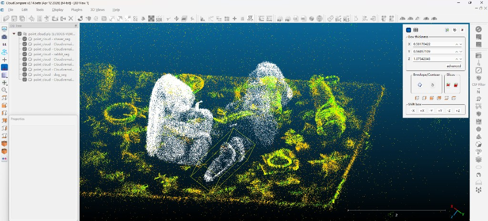
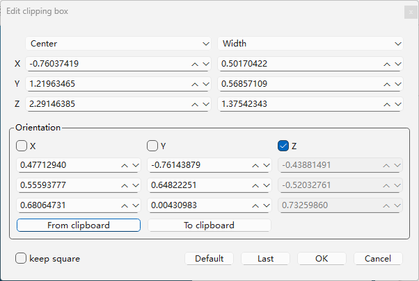
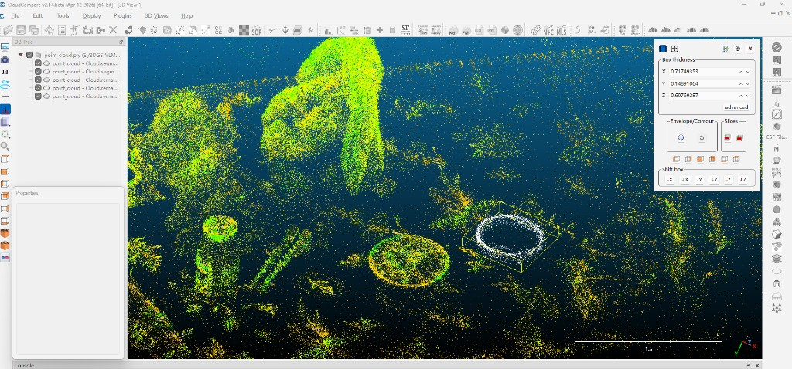
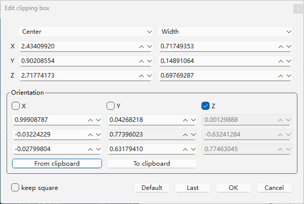

# GSrefer3D

**Language-guided 3D spatial referring**: multi-view **3D Gaussian Splatting** rendering → **RGB-D VLM** (2D point) → geometry fusion → world-space **3D anchor**.

Research integration repo — original code is mainly [`bridge/`](bridge/). Upstream [3DGS](https://github.com/graphdeco-inria/gaussian-splatting) and [RoboRefer](https://github.com/Zhoues/RoboRefer) are **cloned locally**, not vendored in full. See [docs/UPSTREAM_SETUP.md](docs/UPSTREAM_SETUP.md).

## Pipeline


**3DGS** (once per scene): multi-view photos → COLMAP → `train.py` → `point_cloud.ply`.

**Bridge (online)**: `render.py` (RGB-D + `depth_raw` + cameras) → **RoboRefer API** (text → 2D) → **fuse_multiview** → `P_world` → overlays / SIBR.

**Bridge (offline SFT)**: anchor `P_world` → per-view **project** → **ray occlusion filter** → **SAM2** masks → **centroid refine** → `data2_sft` → **LoRA** → merged API weights.

> **Note:** The repo’s *default* fuse CLI uses **`depth_mode=ray`** (ray pull-in on Gaussians). The **experiment timeline** below follows what was actually run: **initial fusion used invdepth + snap-to-vertex** for training-data construction and Base/LoRA 2D eval; **ray fusion** was added later for 3D OBB re-evaluation.

---

## Results (experiment timeline)

Full tables and run IDs: **[`docs/RESULTS.md`](docs/RESULTS.md)**.

| Step | What | Key artifacts |
|------|------|----------------|
| **1** | Depth ablation (unproject z₀ only) | [`depth_compare_batch.json`](docs/depth_compare_batch.json) |
| **2** | Manual **OBB** in CloudCompare (11 objects) | [`bbox_data2.json`](docs/bbox_data2.json), [`docs/bbox_labels/`](docs/bbox_labels/) |
| **3** | **Initial fusion** (invdepth + snap) → training pack | `fused.json`, 469× RGB-D SFT |
| **4** | **LoRA** SFT on `data2_location` | `RoboRefer-2B-SFT-data2-merged` |
| **5** | **Base vs LoRA** — in-domain 2D + hold-out tape | [`results_2d_eval.json`](docs/results_2d_eval.json), overlays |
| **6** | **RefSpatial-Expand-Bench** (OOD) | Location / Placement % |
| **7** | **Ray fusion** + 3D OBB eval vs manual box | `fused_ray.json`, [`results_3d_obb_hit.json`](docs/results_3d_obb_hit.json) |

---

### 1 · Depth ablation (why we use 3DGS `depth_raw`)


Fixed referring pixel + camera; only the **depth source for z₀** changes → unproject → NN distance to `point_cloud.ply` (**lower is better**). Does **not** include later ray refinement.

| Source | median NN (m) |
|--------|---------------|
| **3DGS `depth_raw`** | **0.133** |
| DAV2 affine | 0.368 |
| DAV2 raw | 0.572 |

**15/20** groups: 3DGS &lt; DAV2 affine. Regenerate: `python bridge/plot_depth_ablation_teaser.py`.

---

### 2 · Manual 3D OBB anchors (CloudCompare)

On `point_cloud.ply` (data2), each of **11 objects** (10 training + **double-sided tape** hold-out) got an oriented box via **Cross Section → segment → Edit clipping box**. Parameters are in **[`docs/bbox_data2.json`](docs/bbox_data2.json)** (`center`, `width`, `half_extent`, `rotation_columns`; same world frame as `fused.json`).

| Field | Meaning |
|-------|---------|
| `objects.<key>.obb` | Primary eval geometry |
| `screenshot` | CloudCompare viewport after fitting |
| `screenshot_obb_dialog` | Edit clipping box dialog (dimensions / rotation) |

**Examples (labeling screenshots in repo):**

| Object | Viewport | Edit dialog |
|--------|----------|-------------|
| Electric shaver |  |  |
| Double-sided tape (hold-out) |  |  |

All 11 objects: PNGs under [`docs/bbox_labels/`](docs/bbox_labels/) (paths listed per object in `bbox_data2.json`).

---

### 3 · Initial fusion → multi-view training data (469)

**Fusion policy at this stage:** raster **`expected_invdepth`** at the click + **snap fused point to nearest Gaussian** (`fused.json` in e2e runs; no ray pull-in yet).

Pipeline: fused **`P_world`** → [`gen_training_data.py`](bridge/gen_training_data.py) **project** → **ray occlusion filter** → **DINO + SAM2** → **mask-centroid refine** → export **`data2_sft`** (469 RGB-D Location tuples).


| Panel | Object | `move` (px) |
|-------|--------|-------------|
| Top-left | Golden bowl | 118.5 |
| Top-right | Hair clip | 27.5 |
| Bottom-left | Electric shaver | 75.3 |
| Bottom-right | Umbrella | 197.2 |

---

### 4 · LoRA fine-tuning

**2B LoRA** (1 epoch) on mixture **`data2_location`** → merged weights **`RoboRefer-2B-SFT-data2-merged`** (API). Base = **`RoboRefer-2B-SFT`** without adapter.

---

### 5 · Base vs LoRA — in-domain 2D and hold-out

Same **72-view** render pack and **initial fusion** settings; only the RoboRefer checkpoint changes.

**In-domain (10 objects, synthetic 2D GT):** LoRA **median L2 ≤ Base on all 10/10**.

| Object | Base median L2 | LoRA median L2 | Δ |
|--------|----------------|----------------|---|
| Umbrella | 0.067 | **0.011** | −0.056 |
| Golden retriever | 0.062 | **0.008** | −0.053 |
| Brown rabbit | 0.037 | **0.007** | −0.031 |
| Golden bowl | 0.009 | **0.003** | −0.006 |

Full table: [`docs/RESULTS.md`](docs/RESULTS.md) §2 · [`results_2d_eval.json`](docs/results_2d_eval.json).

**Overlays** (3 views × Base | LoRA; green = fuse inliers):

| Object | Figure |
|--------|--------|
| Umbrella |  |
| Golden retriever |  |
| Brown rabbit |  |
| Electric shaver |  |

**Hold-out — double-sided tape** (not in 469 SFT labels; qualitative 2D only):


**3D anchor in SIBR** (initial fusion, red marker at `P_world`; LoRA runs):


---

### 6 · RefSpatial-Expand-Bench (out-of-domain)

| Task | Base | LoRA (data2) | Δ |
|------|------|--------------|---|
| **Location** | **50.21%** | 45.64% | −4.57 pp |
| **Placement** | **48.50%** | 47.00% | −1.50 pp |

Domain-adapted LoRA improves **in-domain data2** but **does not** improve this OOD bench (report separately from §5).

---

### 7 · Improved fusion (ray depth) + 3D OBB evaluation

**Same 2D predictions** as §5; re-fuse with **`depth_mode=ray`** ([`ray_unproject.py`](bridge/ray_unproject.py)) → **`fused_ray.json`**. Compare **Base** (`fused.json`, initial policy) vs **LoRA** (`fused_ray.json`) against manual OBB (§2).

| Object | Base hit | LoRA hit | Base outside (m) | LoRA outside (m) |
|--------|:--------:|:--------:|------------------:|------------------:|
| Electric shaver | ✓ | ✓ | 0.000 | 0.000 |
| Brown rabbit | ✓ | ✓ | 0.000 | 0.000 |
| Cookie bag | ✗ | **✓** | 0.006 | 0.000 |
| Golden bowl | ✗ | **✓** | 0.126 | 0.000 |
| Double-sided tape | ✗ | **✓** | 0.056 | 0.000 |
| Hair clip | ✗ | ✗ | 0.086 | 0.104 |
| *(others)* | ✓ | ✓ | 0.000 | 0.000 |

**Hit rate:** Base **63.6%** (7/11) · LoRA **90.9%** (10/11). JSON: [`results_3d_obb_hit.json`](docs/results_3d_obb_hit.json) · [`results_3d_obb_offset.json`](docs/results_3d_obb_offset.json).

```powershell
python bridge/eval_3d_obb_offset.py --refuse-lora-ray   # writes fused_ray.json + metrics
python bridge/inject_obb_compare.py --preset electric_shaver
python bridge/inject_obb_compare.py --preset double_sided_tape
```

**SIBR — OBB wireframe + Base/LoRA points** ([`inject_obb_compare.py`](bridge/inject_obb_compare.py)): cyan = OBB · blue = Base · magenta = LoRA (ray).


---

## Repository layout (what is in Git)

| Path | In Git? | Role |
|------|---------|------|
| [`bridge/`](bridge/) | **Yes** | 2D→3D, fuse, e2e, eval, training export |
| [`docs/bbox_data2.json`](docs/bbox_data2.json) | **Yes** | Manual OBB parameters (11 objects) |
| [`docs/bbox_labels/*.png`](docs/bbox_labels/) | **Yes** | CloudCompare labeling screenshots |
| [`docs/results_*.json`](docs/) | **Yes** | 2D / 3D OBB / depth ablation metrics |
| [`demo/`](demo/) | **Partial** | Pipeline figure, teasers, SIBR GIFs (see `.gitignore`) |
| `3DGS/gaussian-splatting/`, `RoboRefer-main/` | **No** | Clone locally — [setup](docs/UPSTREAM_SETUP.md) |
| `training_data/`, `3DGS/test2/runs/` | **No** | Local experiments |

## Quick start

**Prerequisites:** clone 3DGS and RoboRefer, download weights — [docs/UPSTREAM_SETUP.md](docs/UPSTREAM_SETUP.md).

```powershell
# Render pack (envGS)
cd 3DGS
python render.py -m gaussian-splatting/output/data2 --custom_views --output_path ../test2

# RoboRefer API (WSL/cloud), then:
python bridge/roborefer_client.py --root 3DGS/test2 --url http://127.0.0.1:25547 --prompt "Please point to ..."

# Fuse (default in repo: ray; historical e2e used invdepth+snap)
python bridge/fuse_multiview.py --predictions 3DGS/test2/predictions.json `
  --ply 3DGS/gaussian-splatting/output/data2/point_cloud/iteration_30000/point_cloud.ply `
  --depth-mode ray --output 3DGS/test2/fused.json

# Or one-shot e2e
python bridge/run_bridge_e2e.py --model-path 3DGS/gaussian-splatting/output/data2 `
  --custom-views-out 3DGS/test2 --prompt "..." --snap --url http://127.0.0.1:25547
```

**Eval:**

```powershell
python bridge/eval_2d_vs_gt.py --out docs/results_2d_eval.json
python bridge/eval_3d_obb_offset.py --refuse-lora-ray --out docs/results_3d_obb_offset.json
```

## What we changed upstream (short)

| Upstream | Shipped here |
|----------|----------------|
| 3DGS | `3DGS/render.py`, `patches/3dgs/` |
| RoboRefer | `patches/roborefer/INTEGRATION.md` |

## License

- **MIT** — `bridge/`, public `docs/` and `demo/` assets listed in `.gitignore`, `patches/`, `3DGS/render.py` ([LICENSE](LICENSE)).
- **Upstream** — see [THIRD_PARTY.md](THIRD_PARTY.md).

## Citation

Cite upstream 3DGS and RoboRefer. This repo is a student research workspace, not an official release of either project.

## Public data files

| File | Use |
|------|-----|
| [docs/UPSTREAM_SETUP.md](docs/UPSTREAM_SETUP.md) | Clone & weights |
| [docs/RESULTS.md](docs/RESULTS.md) | Full tables (chronological) |
| [docs/bbox_data2.json](docs/bbox_data2.json) | Manual OBB (11 objects) |
| [docs/bbox_labels/](docs/bbox_labels/) | CloudCompare labeling PNGs |
| [docs/depth_compare_batch.json](docs/depth_compare_batch.json) | Step 1 depth ablation |
| [docs/results_2d_eval.json](docs/results_2d_eval.json) | Step 5 in-domain 2D |
| [docs/results_3d_obb_hit.json](docs/results_3d_obb_hit.json) | Step 7 OBB hit rate |
| [docs/results_3d_obb_offset.json](docs/results_3d_obb_offset.json) | Step 7 outside offset |
