# GSrefer3D

**Language-guided 3D spatial referring**: multi-view **3D Gaussian Splatting** rendering → **RGB-D VLM** (2D point) → fused `P_world` as a **mask seed only** → Grounding DINO + SAM2 + frustum vote → **object Gaussians**.

Research integration repo — original code is mainly [`bridge/`](bridge/). Upstream [3DGS](https://github.com/graphdeco-inria/gaussian-splatting) and [RoboRefer](https://github.com/Zhoues/RoboRefer) are **cloned locally**, not vendored in Git. Layout notes: [`docs/UPSTREAM_SETUP.md`](docs/UPSTREAM_SETUP.md).

## Pipeline

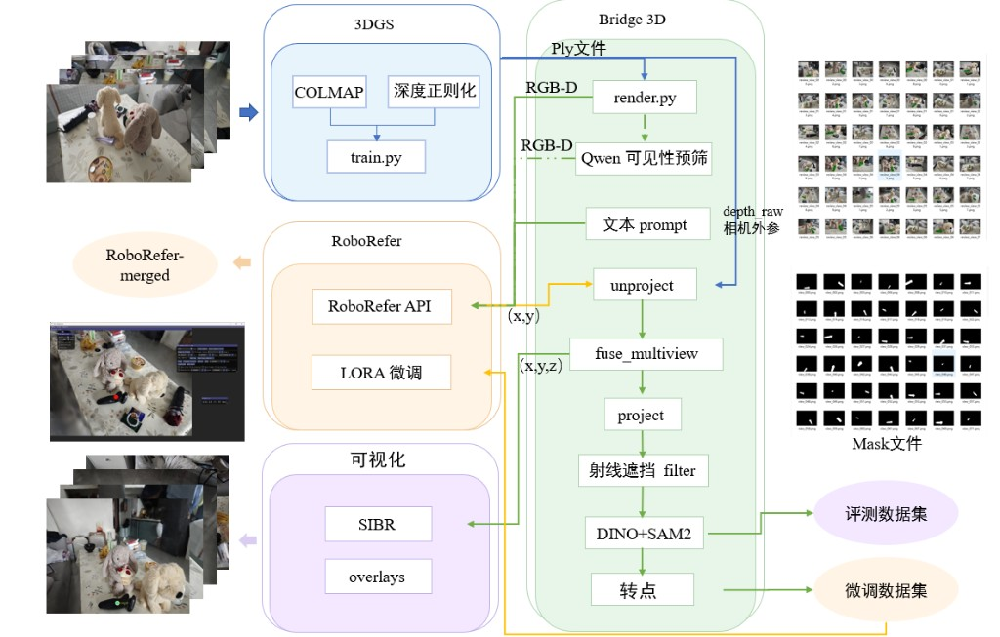

**3DGS** (once per scene): multi-view photos → COLMAP → `train.py` → `point_cloud.ply`. Not part of the online command.

**One command** ([`bridge/run_bridge_e2e.py`](bridge/run_bridge_e2e.py)): trained 3DGS model + text prompt → per-object SFT pack (`question.json` + masks) + frustum-voted Gaussians + SIBR iteration. Internally: render → RoboRefer API → fuse **seed** → project / ray filter → DINO+SAM2 → refine → vote → inject. `--skip-render` reuses an existing view pack.

> **Note:** `P_world` / `fused.json` is only a mask seed. The official 3D output is the **voted Gaussian set** (`gaussian_seg.json`). Historical 469-sample SFT used invdepth + snap; the fuse CLI default is now `depth_mode=ray`. Do not treat seed-point OBB hit tables as the 3D metric.

---

## Quick start

Two Python environments on purpose (cannot share one process): **`envGS`** on Windows for 3DGS + bridge; **`roborefer`** on WSL Ubuntu (or a cloud GPU) for the VLM API and DINO+SAM2.

| Role | Env | Where | Needs |
|------|-----|--------|--------|
| Render / fuse / filter / vote / inject | `envGS` | Windows | CUDA rasterizer, `scipy`, `plyfile`, `requests` |
| RoboRefer HTTP API | `roborefer` | WSL or AutoDL | ~10GB+ VRAM (4060 8GB will OOM; tunnel a 4090) |
| Grounding DINO + SAM2 masks | `roborefer` | WSL with CUDA | SAM2 + GroundingDINO weights |

Laptop 8GB GPU: run **only** `envGS` locally; keep the API on a remote 24GB box and SSH-tunnel port `25547`.

### 0. Clone this repo

```powershell
git clone https://github.com/masterma15/GSrefer3D.git
Set-Location GSrefer3D
```

### 1. `envGS` — 3DGS + bridge (Windows)

```powershell
cd 3DGS
git clone --recursive https://github.com/graphdeco-inria/gaussian-splatting.git
conda env create -f environment-envGS.yml
conda activate envGS
```

Do **not** use upstream `gaussian-splatting/environment.yml` (Python 3.7). This project’s file is Python 3.9, PyTorch 2.4 + CUDA 11.8, and includes **scipy** (ray-filter KD-tree).

Compile CUDA extensions from `3DGS/gaussian-splatting/`:

```powershell
Set-Location gaussian-splatting
$env:DISTUTILS_USE_SDK = "1"
pip install submodules/diff-gaussian-rasterization
pip install submodules/simple-knn
pip install submodules/fused-ssim
Set-Location ..
```

`3DGS/render.py` is already in this repo (custom multi-view RGB-D export). Optional accel rasterizer: copy [`patches/3dgs/gaussian_renderer__init__.py`](patches/3dgs/gaussian_renderer__init__.py) over `gaussian-splatting/gaussian_renderer/__init__.py`.

Train a scene once (example `data2`; `-r 4` = 1/4 resolution). Phone photos: strip EXIF first.

```powershell
magick mogrify -strip gaussian-splatting/data2/input/*.jpg
python convert.py -s gaussian-splatting/data2
python train.py -s gaussian-splatting/data2 -r 4
```

Output model: `3DGS/gaussian-splatting/output/data2/`. You can skip COLMAP/train if you already have `point_cloud/iteration_*/point_cloud.ply`.

SIBR viewer (optional): unzip [official binaries](https://repo-sam.inria.fr/fungraph/3d-gaussian-splatting/binaries/viewers.zip) into `3DGS/gaussian-splatting/viewers/`. Always launch from `viewers/bin/` or `sibr_system.dll` will not load.

### 2. `roborefer` — VLM API (WSL Ubuntu or Linux cloud)

```bash
# WSL, repo mounted e.g. /mnt/e/GSrefer3D
cd /mnt/e/GSrefer3D
git clone https://github.com/Zhoues/RoboRefer.git RoboRefer-main
cd RoboRefer-main
bash env_setup.sh roborefer
conda activate roborefer
```

Upstream install uses Python 3.10.14, PyTorch 2.5, FlashAttention 2.5.8 (Linux wheel). Then pin:

```bash
pip install huggingface-hub==0.28.1
# do not pip install -U huggingface_hub
```

Apply the four small edits in [`patches/roborefer/INTEGRATION.md`](patches/roborefer/INTEGRATION.md) (`datasets_mixture.py` identifier fix + `data2_location` register, `Trainer.log` signature, optional API default paths, single-GPU `SLURM_JOB_GPUS_PER_NODE=1`).

**Weights** (not in Git; put at repo root):

| File | Path | Source |
|------|------|--------|
| RoboRefer 2B SFT | `RoboRefer-2B-SFT/` | [Zhoues/RoboRefer-2B-SFT](https://huggingface.co/Zhoues/RoboRefer-2B-SFT) |
| Depth Anything V2 ViT-L | `weights/depth_anything_v2_vitl.pth` | [depth-anything/Depth-Anything-V2-Large](https://huggingface.co/depth-anything/Depth-Anything-V2-Large/resolve/main/depth_anything_v2_vitl.pth) |
| SAM 2.1 Hiera-L | `weights/sam2.1_hiera_large.pt` | [facebook/sam2.1](https://dl.fbaipublicfiles.com/segment_anything_2/092824/sam2.1_hiera_large.pt) |
| Grounding DINO Swin-T | `weights/groundingdino_swint_ogc.pth` | [IDEA-Research release](https://github.com/IDEA-Research/GroundingDINO/releases/download/v0.1.0-alpha/groundingdino_swint_ogc.pth) |
| data2 LoRA (optional) | `RoboRefer-2B-SFT-data2-merged/` | merge local LoRA; else use the 2B base |

```bash
# from repo root (WSL or Linux)
mkdir -p weights
huggingface-cli download Zhoues/RoboRefer-2B-SFT --local-dir RoboRefer-2B-SFT
wget -O weights/depth_anything_v2_vitl.pth \
  https://huggingface.co/depth-anything/Depth-Anything-V2-Large/resolve/main/depth_anything_v2_vitl.pth
wget -O weights/sam2.1_hiera_large.pt \
  https://dl.fbaipublicfiles.com/segment_anything_2/092824/sam2.1_hiera_large.pt
wget -O weights/groundingdino_swint_ogc.pth \
  https://github.com/IDEA-Research/GroundingDINO/releases/download/v0.1.0-alpha/groundingdino_swint_ogc.pth
```

### 3. DINO + SAM2 inside `roborefer` (WSL)

Mask stage is invoked by the e2e command via `wsl bash` (Windows default). Install these **in WSL `roborefer`**, not in `envGS`.

```bash
conda activate roborefer
cd /mnt/e/GSrefer3D
git clone https://github.com/IDEA-Research/GroundingDINO.git
pip install addict timm yapf supervision pycocotools
# PYTHONPATH to GroundingDINO is enough; pip install -e . often fails in this env

git clone https://github.com/facebookresearch/sam2.git
cd sam2 && pip install -e . && cd ..
```

### 4. Start RoboRefer API (keep this terminal open)

WSL / Linux:

```bash
conda activate roborefer
cd /mnt/e/GSrefer3D/RoboRefer-main/API
python api.py --port 25547 --host 0.0.0.0 \
  --depth_model_path /mnt/e/GSrefer3D/weights/depth_anything_v2_vitl.pth \
  --vlm_model_path /mnt/e/GSrefer3D/RoboRefer-2B-SFT
```

Cloud GPU (recommended if local VRAM &lt; 16GB), then on Windows:

```powershell
ssh -CNg -L 25547:127.0.0.1:25547 -p <port> root@<host>
```

Leave the tunnel up. The e2e client still uses `--url http://127.0.0.1:25547`.

### 5. Run the pipeline (Windows `envGS`)

`--prompt` is the VLM instruction. `--object` is the short DINO caption (not inferred). `--name` is the output folder slug. `--custom-views-out` is the multi-view pack (default `3DGS/test2`, overridable).

```powershell
conda activate envGS
Set-Location E:\GSrefer3D

# First object: render  + query + fuse seed + mask + vote + SIBR inject
python bridge/run_bridge_e2e.py `
  --model-path 3DGS/gaussian-splatting/output/data2 `
  --custom-views-out 3DGS/test2 `
  --prompt "Please point to the electric shaver on the desk." `
  --object "electric shaver" `
  --name data2_shaver `
  --url http://127.0.0.1:25547

# Same scene, new object: reuse the view pack (skip the expensive render)
python bridge/run_bridge_e2e.py `
  --model-path 3DGS/gaussian-splatting/output/data2 `
  --custom-views-out 3DGS/test2 `
  --prompt "Please point to the brown stuffed rabbit." `
  --object "plush rabbit" `
  --name data2_rabbit `
  --skip-render --url http://127.0.0.1:25547
```

Preflight: API down → exit **10**; WSL / mask weights missing → exit **11**. One bad view is skipped; the command only dies if a whole stage is empty (no query inliers, no masks, zero voted Gaussians).

| Flag | Meaning |
|------|---------|
| `--skip-render` | Same as `--from query`; require `rgb/`, `camera_params/`, `depth_raw/` under `--custom-views-out` |
| `--from fuse\|filter\|mask\|vote` | Resume after a crash |
| `--pause-after-mask` | Write review PNGs and stop; continue with `--from vote` |
| `--out-dir` | Override `training_data/<name>/` |
| `--bbox-key` | Key in `docs/bbox_data2.json`; if found, overlay OBB + run 3D eval |
| `--clean` | After success, delete overlays / review / rejected-view dumps only |
| `--no-use-wsl` | Run DINO+SAM in the current env (Linux with CUDA) |

Does **not** write `training_data/data2_sft/` (merge 10 objects later with `bridge/export_spatial_train.py` if you train).

**Outputs**

| Path | What |
|------|------|
| `training_data/<name>/` | SFT pack: `question.json`, `mask/`, `gaussian_seg.json` + `.ply` |
| `<views>/runs/<run_id>/` | `predictions.json`, `fused.json` (seed), overlays, `run_manifest.json` |
| `<model>/point_cloud/iteration_seg_<name>/` | SIBR recolor (does not touch `iteration_30000`) |

```powershell
Set-Location E:\GSrefer3D\3DGS\gaussian-splatting\viewers\bin
.\SIBR_gaussianViewer_app.exe -m "E:\GSrefer3D\3DGS\gaussian-splatting\output\data2" --iteration seg_data2_shaver
```

Magenta = selected ∩ OBB · lime = selected outside OBB · cyan = hand OBB · blue = seed (optional).

**Eval** (after packs exist):

```powershell
python bridge/eval_2d_vs_gt.py --out docs/results_2d_eval.json
python bridge/eval_gaussian_seg.py --obj-glob training_data/data2_* --output docs/results_gaussian_seg.json
```

---

## Results (experiment timeline)

Full tables and run IDs: **[`docs/RESULTS.md`](docs/RESULTS.md)**.

| Step | What | Key artifacts |
|------|------|----------------|
| **1** | Depth ablation (unproject z₀ only) | [`depth_compare_batch.json`](docs/depth_compare_batch.json) |
| **2** | Manual **OBB** in CloudCompare (11 objects) | [`bbox_data2.json`](docs/bbox_data2.json), [`docs/bbox_labels/`](docs/bbox_labels/) |
| **3** | **Initial fusion** (invdepth + snap) → mask seed + 469 SFT pack | `fused.json` (seed only) |
| **4** | **LoRA** SFT on `data2_location` | `RoboRefer-2B-SFT-data2-merged` |
| **5** | **Base vs LoRA** — in-domain 2D + hold-out tape | [`results_2d_eval.json`](docs/results_2d_eval.json), overlays |
| **6** | **RefSpatial-Expand-Bench** (OOD) | Location / Placement % |
| **7** | **Frustum-vote 3D instance** vs hand OBB | [`results_gaussian_seg.json`](docs/results_gaussian_seg.json) |

---

### 1 · Depth ablation (why we use 3DGS `depth_raw`)

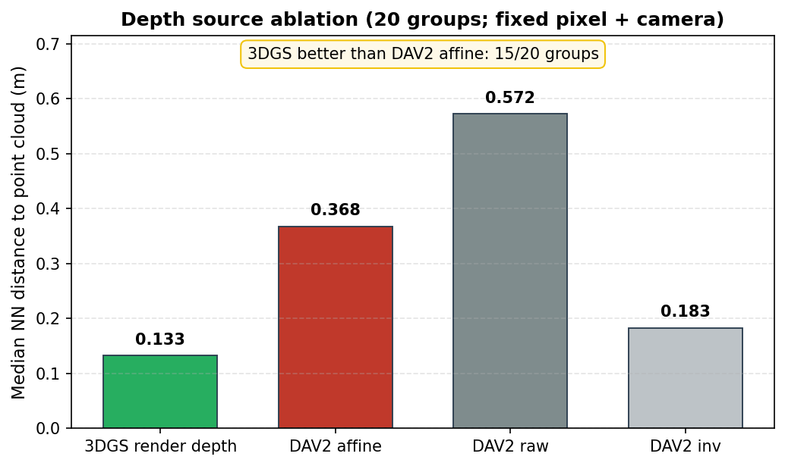

Fixed referring pixel + camera; only the **depth source for z₀** changes → unproject → NN distance to `point_cloud.ply` (**lower is better**). Does **not** include later ray refinement.

| Source | median NN (m) |
|--------|---------------|
| **3DGS `depth_raw`** | **0.133** |
| DAV2 affine | 0.368 |
| DAV2 raw | 0.572 |

**15/20** groups: 3DGS &lt; DAV2 affine. Numbers: [`docs/depth_compare_batch.json`](docs/depth_compare_batch.json).

---

### 2 · Manual 3D OBB anchors (CloudCompare)

On `point_cloud.ply` (data2), each of **11 objects** (10 training + **double-sided tape** hold-out) got an oriented box via **Cross Section → segment → Edit clipping box**. Parameters are in **[`docs/bbox_data2.json`](docs/bbox_data2.json)** (`center`, `width`, `half_extent`, `rotation_columns`). The 10 training boxes are the GT for frustum-vote 3D eval; the tape box is hold-out / qualitative only.

| Field | Meaning |
|-------|---------|
| `objects.<key>.obb` | Primary eval geometry |
| `screenshot` | CloudCompare viewport after fitting |
| `screenshot_obb_dialog` | Edit clipping box dialog (dimensions / rotation) |

**Examples (labeling screenshots in repo):**

| Object | Viewport | Edit dialog |
|--------|----------|-------------|
| Electric shaver | 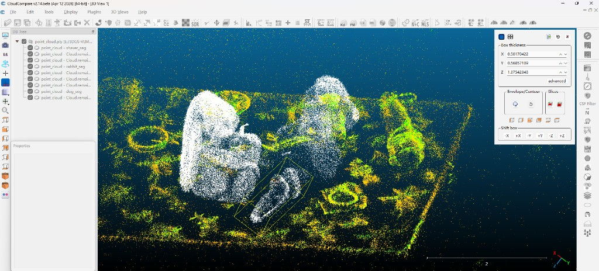 | 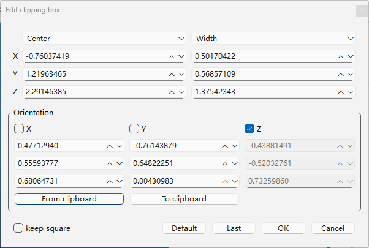 |
| Double-sided tape (hold-out) | 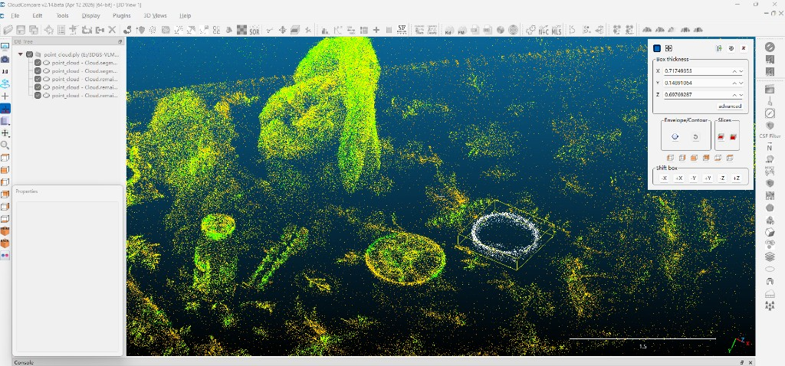 | 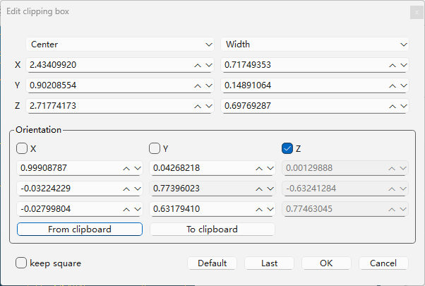 |

All 11 objects: PNGs under [`docs/bbox_labels/`](docs/bbox_labels/) (paths listed per object in `bbox_data2.json`).

---

### 3 · Initial fusion → multi-view training data (469)

**Fusion policy at this stage:** raster **`expected_invdepth`** at the click + **snap fused point to nearest Gaussian**. The fused point is a **mask seed**, not the 3D answer.

Pipeline: seed **`P_world`** → [`gen_training_data.py`](bridge/gen_training_data.py) **project** → **ray occlusion filter** → **DINO + SAM2** → **mask-centroid refine** → export **`data2_sft`** (469 RGB-D Location tuples) and later **frustum vote**.

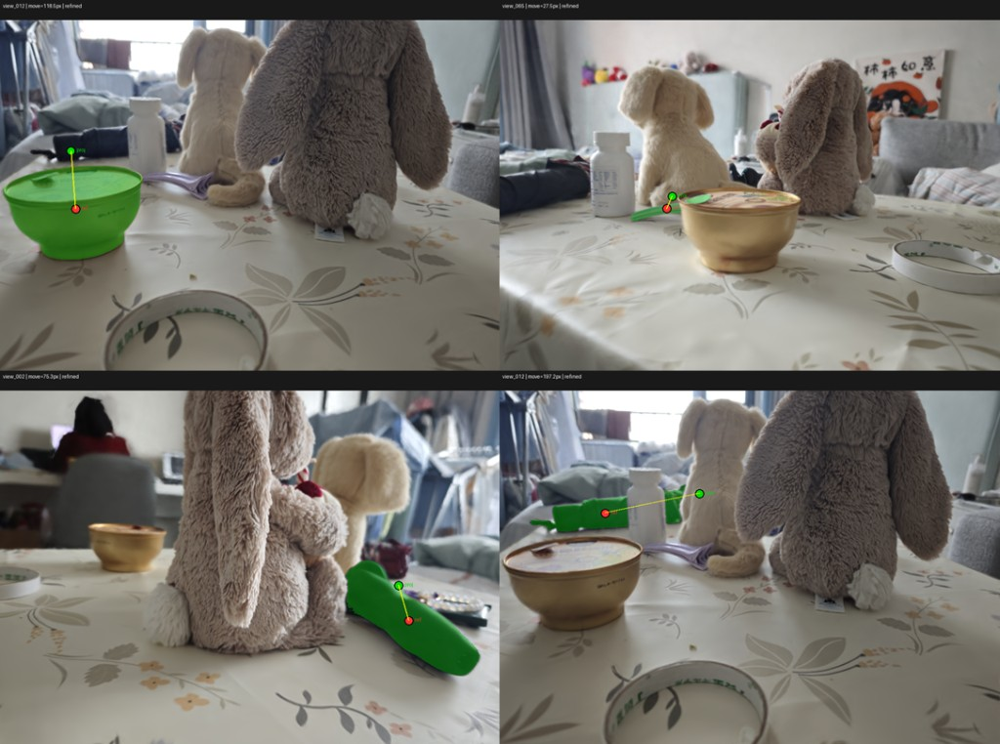

| Panel | Object | `move` (px) |
|-------|--------|-------------|
| Top-left | Golden bowl | 118.5 |
| Top-right | Hair clip | 27.5 |
| Bottom-left | Electric shaver | 75.3 |
| Bottom-right | Umbrella | 197.2 |

---

### 4 · LoRA fine-tuning

**2B LoRA** (1 epoch) on mixture **`data2_location`** → merged weights **`RoboRefer-2B-SFT-data2-merged`** (API). Base = **`RoboRefer-2B-SFT`** without adapter.

---

### 5 · Base vs LoRA — in-domain 2D and hold-out

Same **72-view** render pack and **initial fusion** settings; only the RoboRefer checkpoint changes.

**In-domain (10 objects, synthetic 2D GT):** LoRA **median L2 ≤ Base on all 10/10**.

| Object | Base median L2 | LoRA median L2 | Δ |
|--------|----------------|----------------|---|
| Umbrella | 0.067 | **0.011** | −0.056 |
| Golden retriever | 0.062 | **0.008** | −0.053 |
| Brown rabbit | 0.037 | **0.007** | −0.031 |
| Golden bowl | 0.009 | **0.003** | −0.006 |

Full table: [`docs/RESULTS.md`](docs/RESULTS.md) §2 · [`results_2d_eval.json`](docs/results_2d_eval.json).

**Overlays** (3 views × Base | LoRA; green = fuse inliers):

| Object | Figure |
|--------|--------|
| Umbrella | 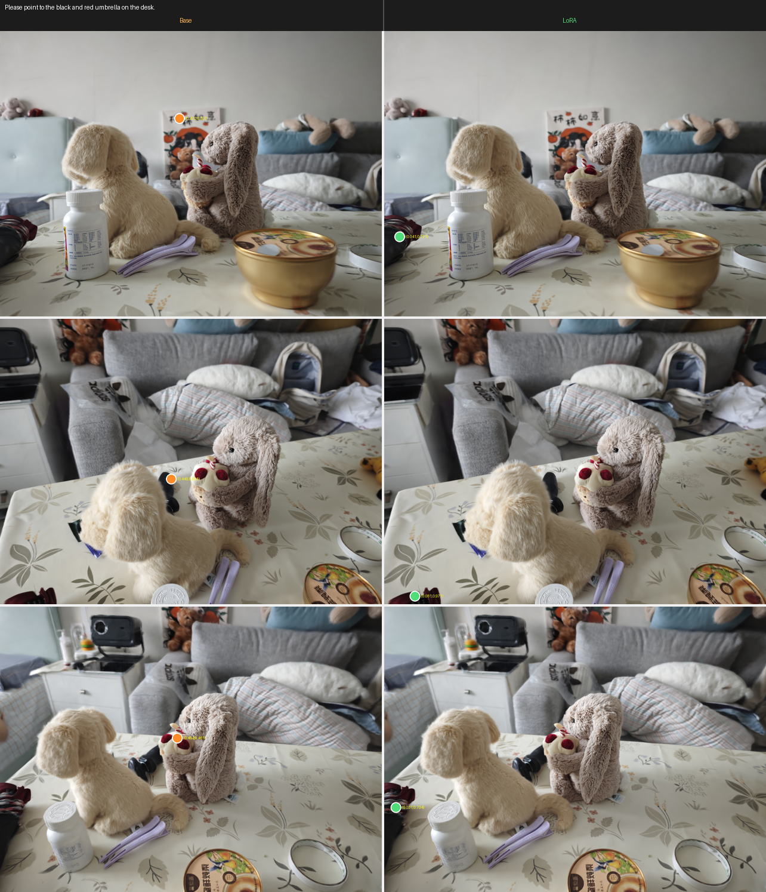 |
| Golden retriever | 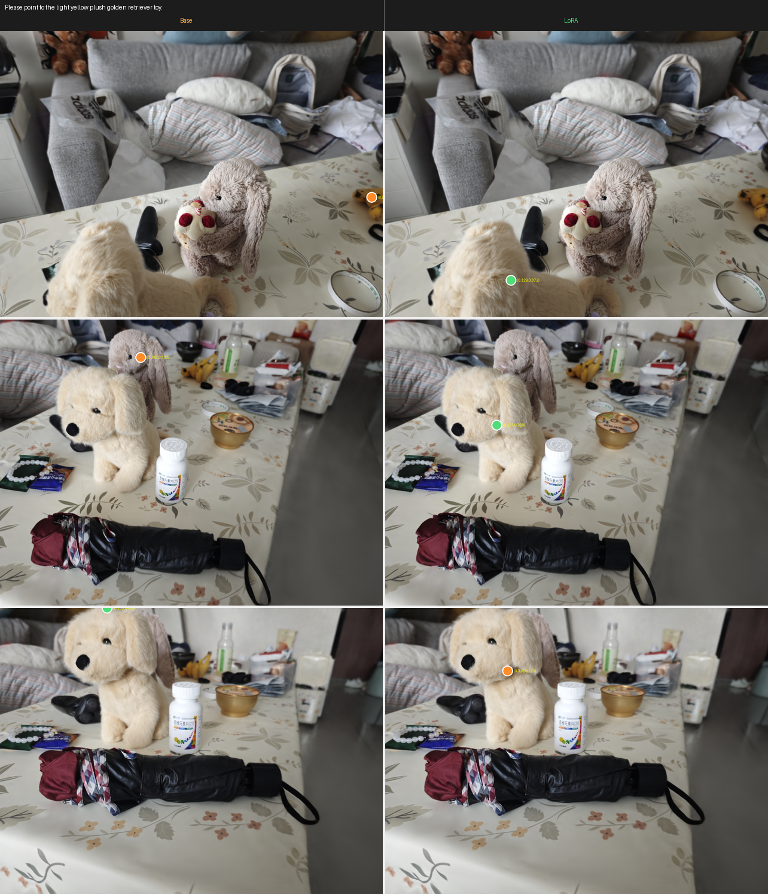 |
| Brown rabbit | 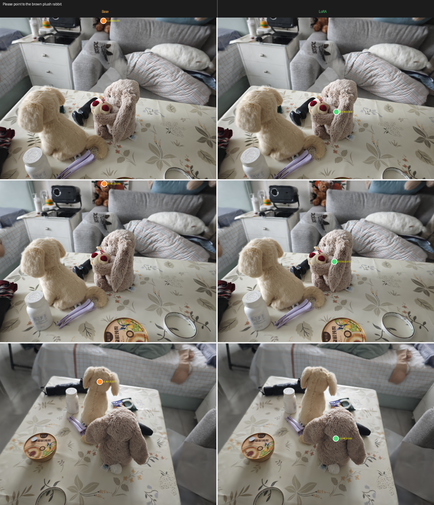 |
| Electric shaver | 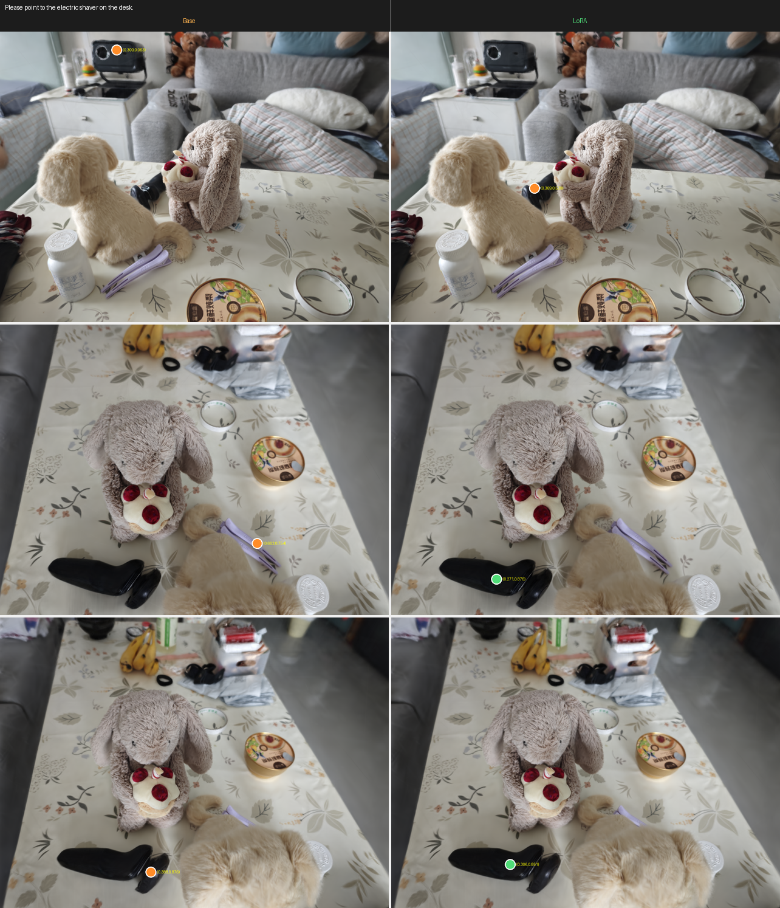 |

**Hold-out — double-sided tape** (not in 469 SFT; **not** in the 10-object 2D table). GT = SAM2 mask centroid (`training_data/data2_tape/question.json`, 46 views).

| Group | n | median L2↓ | mean L2 | %&lt;0.05 | Δ median |
|-------|---|------------|---------|----------|----------|
| Base | 46 | 0.0214 | 0.1666 | 56.5% | — |
| LoRA | 46 | **0.0132** | 0.1528 | 63.0% | **−0.0082** |

JSON: [`docs/results_2d_eval_tape.json`](docs/results_2d_eval_tape.json). Overlay:

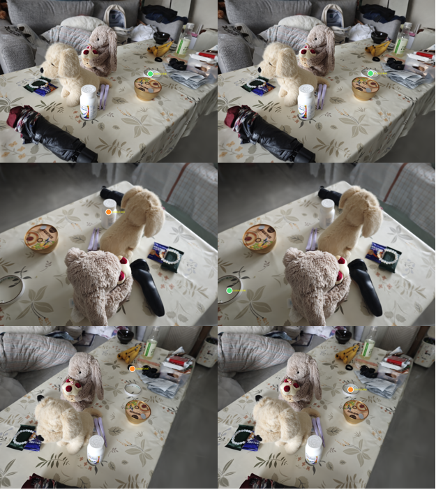

---

### 6 · RefSpatial-Expand-Bench (out-of-domain)

| Task | Base | LoRA (data2) | Δ |
|------|------|--------------|---|
| **Location** | **50.21%** | 45.64% | −4.57 pp |
| **Placement** | **48.50%** | 47.00% | −1.50 pp |

Domain-adapted LoRA improves **in-domain data2** but **does not** improve this OOD bench (report separately from §5).

---

### 7 · 3D instance (frustum vote vs manual OBB)

`P_world` is only a seed for Grounding DINO + SAM2 masks. The reported 3D result is the **voted Gaussian set** (`--min-vote-frac 0.5`). Primary metrics: vote-centroid in OBB, fraction of selected Gaussians inside the box, 2D mask reprojection precision.

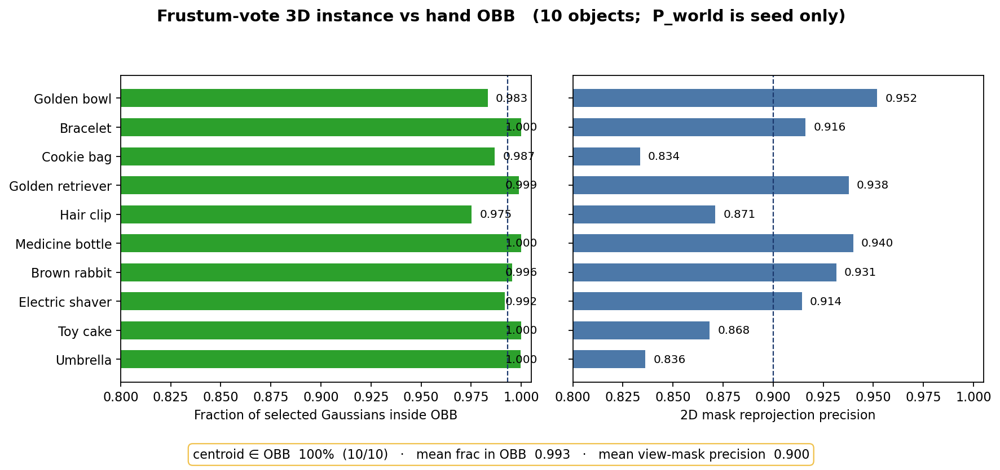

| Metric | Value (10 training objects) |
|--------|-----------------------------|
| Vote centroid ∈ hand OBB | **10 / 10** |
| Mean fraction of selected Gaussians in OBB | **0.993** |
| Mean 2D mask reprojection precision | **0.900** |

Hair-clip seed can sit ~10 cm outside the thin OBB; the **vote centroid is inside**. Per-object table: [`docs/RESULTS.md`](docs/RESULTS.md) §2b · [`results_gaussian_seg.json`](docs/results_gaussian_seg.json).

```powershell
python bridge/eval_gaussian_seg.py --obj-glob training_data/data2_* --output docs/results_gaussian_seg.json
python bridge/plot_gaussian_seg_teaser.py
python bridge/inject_gaussian_seg.py --obj-glob training_data/data2_*
```

SIBR: magenta = selected ∩ OBB · lime = selected \ OBB · cyan = hand OBB · optional blue = seed.

**SIBR orbit** (voted Gaussians vs hand OBB — these are the 3D result, not the old fused-point / seed-marker GIFs):

| Electric shaver | Brown rabbit |
|-----------------|--------------|
|  | 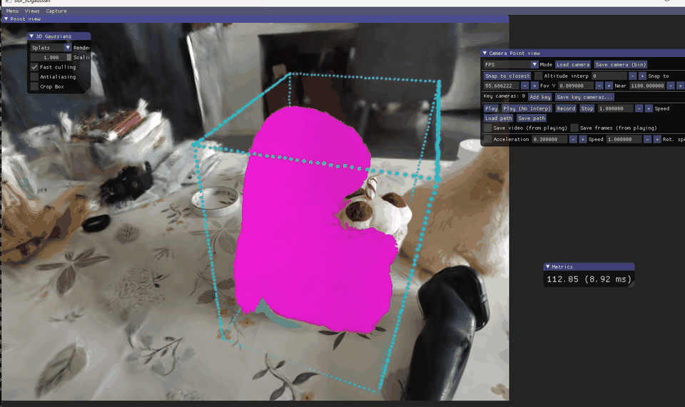 |

| Golden retriever | Umbrella |
|------------------|----------|
| 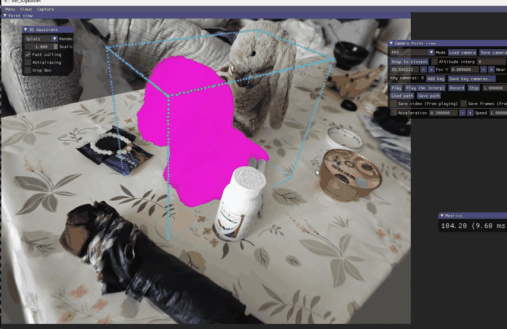 | 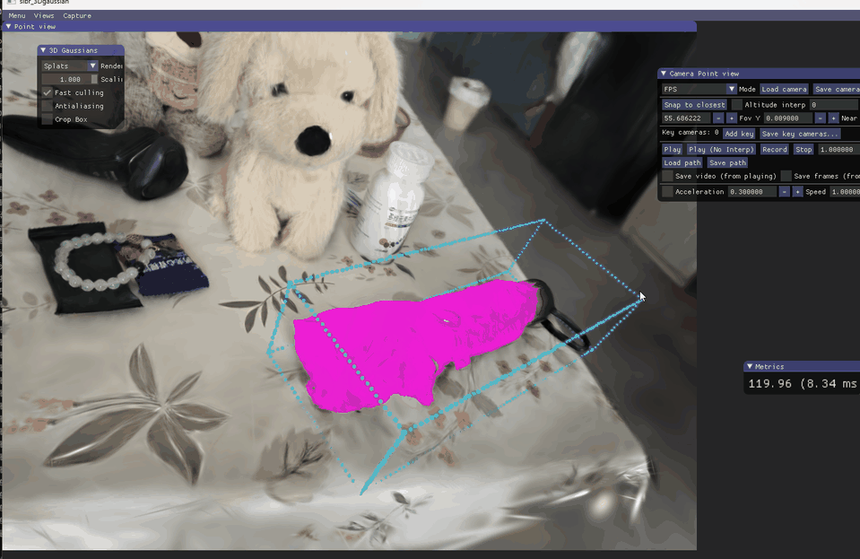 |

| Toy cake | Hair clip |
|----------|-----------|
| 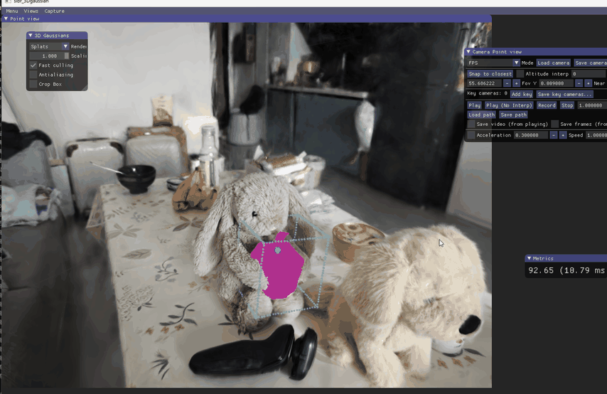 | 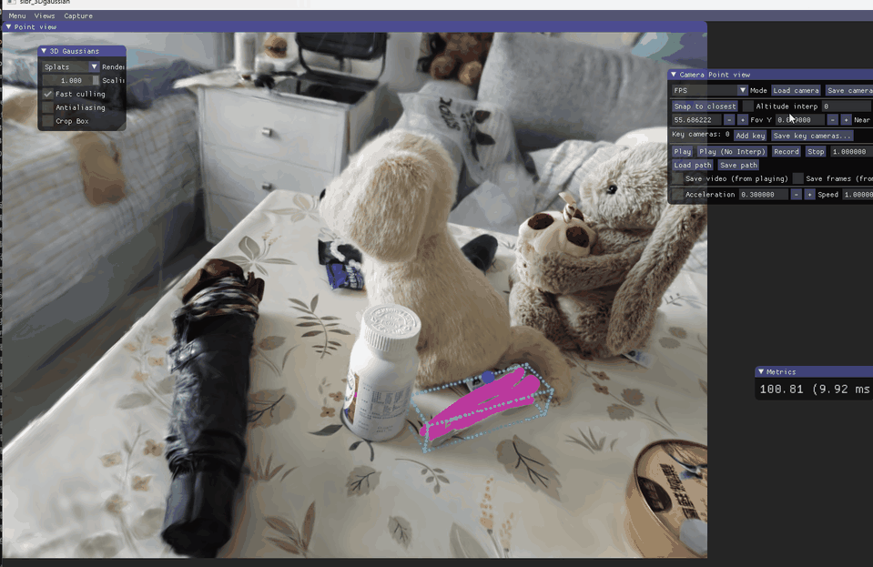 |

**Hold-out** (not in 469 SFT / not in the 10-object 3D summary):

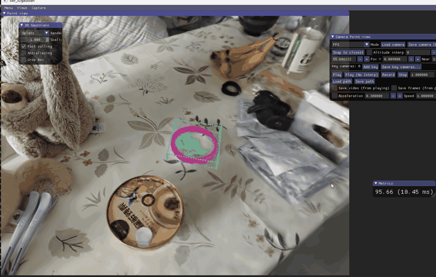

---

## Repository layout (what is in Git)

| Path | In Git? | Role |
|------|---------|------|
| [`bridge/`](bridge/) | **Yes** | 2D→3D, fuse, e2e, eval, training export |
| [`docs/bbox_data2.json`](docs/bbox_data2.json) | **Yes** | Manual OBB parameters (11 objects) |
| [`docs/bbox_labels/*.png`](docs/bbox_labels/) | **Yes** | CloudCompare labeling screenshots |
| [`docs/results_*.json`](docs/) | **Yes** | 2D L2 / frustum-vote 3D / depth ablation |
| [`demo/`](demo/) | **Partial** | Pipeline, 2D teasers, frustum-vote chart, SIBR orbit GIFs (see `.gitignore`) |
| `3DGS/gaussian-splatting/`, `RoboRefer-main/` | **No** | Clone locally — [Quick start](#quick-start) |
| `training_data/`, `3DGS/test2/runs/` | **No** | Local experiments |

## What we changed upstream (short)

| Upstream | Shipped here |
|----------|----------------|
| 3DGS | `3DGS/render.py`, `patches/3dgs/` |
| RoboRefer | `patches/roborefer/INTEGRATION.md` |

## License

- **MIT** — `bridge/`, public `docs/` and `demo/` assets listed in `.gitignore`, `patches/`, `3DGS/render.py` ([LICENSE](LICENSE)).
- **Upstream** — see [THIRD_PARTY.md](THIRD_PARTY.md).

## Citation

Cite upstream 3DGS and RoboRefer. This repo is a student research workspace, not an official release of either project.

## Public data files

| File | Use |
|------|-----|
| [docs/UPSTREAM_SETUP.md](docs/UPSTREAM_SETUP.md) | Clone / weights layout (details in Quick start) |
| [docs/RESULTS.md](docs/RESULTS.md) | Full tables (chronological) |
| [docs/bbox_data2.json](docs/bbox_data2.json) | Manual OBB (11 objects) |
| [docs/bbox_labels/](docs/bbox_labels/) | CloudCompare labeling PNGs |
| [docs/depth_compare_batch.json](docs/depth_compare_batch.json) | Step 1 depth ablation |
| [docs/results_2d_eval.json](docs/results_2d_eval.json) | Step 5 in-domain 2D |
| [docs/results_2d_eval_tape.json](docs/results_2d_eval_tape.json) | Hold-out tape 2D (mask centroid) |
| [docs/results_gaussian_seg.json](docs/results_gaussian_seg.json) | Step 7 frustum-vote 3D instance |
