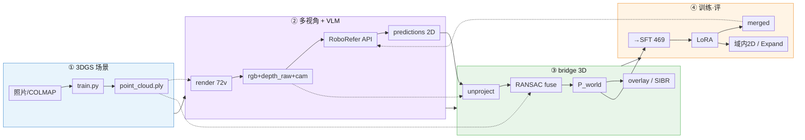
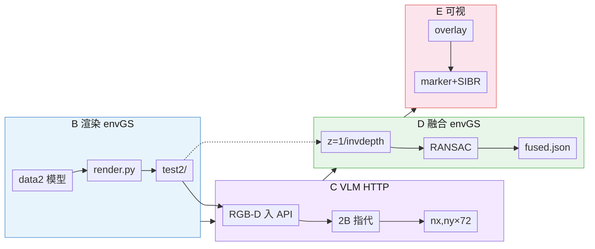
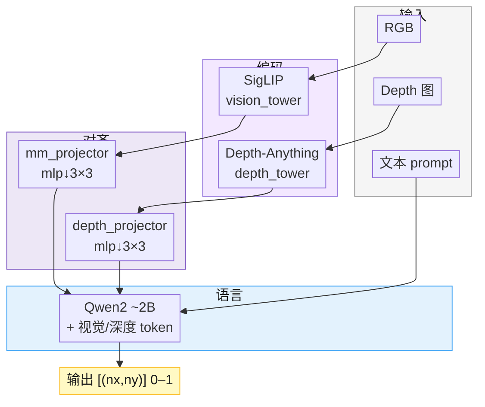

# 3DGS-VLM 系统 Pipeline

> 紧凑版 · 浅色分块 · 含 RoboRefer 结构示意。导出 PNG：`demo/pipeline.png`（建议导出 **§1 总览** 或 **§2 推理+RoboRefer**）。

---

## 1. 总览（推荐导出这一张）

| 色块 | 环境 |
|------|------|
| 蓝 | Windows **envGS** · 3DGS |
| 紫 | WSL/云 **roborefer** · HTTP |
| 绿 | **envGS** · bridge 几何 |
| 橙 | 云 **AutoDL** · SFT/LoRA |

---

## 2. 推理闭环 + RoboRefer 结构（面试展开用）

### 2.1 单次指代 `run_bridge_e2e.py`

**深度（D1）**：反投影只用 **3DGS `depth_raw`**；API 里的 depth 给 VLM 看，不参与 `unproject`。

### 2.2 RoboRefer-2B 要不要画？——要，但只画「和本仓库相关的」

简历/答辩**不必**展开 NVILA 全族，用下面 **一张小结构图** 说明「RGB-D 进、2D 点出」即可；细节被追问再口述。

| 模块 | 本仓库用法 |
|------|------------|
| **vision + depth 双塔** | `enable_depth=1` 时 RGB-D 指代 |
| **projector** | 2B 默认 `mlp_downsample_3x3_fix` |
| **LoRA** | 只训 **LLM**（r=64）；tower/projector **冻结** |
| **bridge 侧** | 只调 `/query` HTTP，**不**改模型代码 |

与 3DGS 的分工：**RoboRefer 负责 2D 语义指哪**；**bridge 负责 2D→3D 几何**（本仓库创新点不在 VLM 结构而在闭环）。

---

## 3. 训练数据（横向紧凑）

```mermaid
%%{init: {'flowchart': {'nodeSpacing': 8, 'rankSpacing': 18, 'padding': 4}}}%%
flowchart LR
  t0["fused P_world"] --> t1["project"] --> t2["filter 可选"]
  t2 --> t3["SAM2 mask"] --> t4["export 469"]
  t4 --> t5["data2_location"] --> t6["LoRA 1ep"]

  style t0 fill:#E8F5E9,stroke:#66BB6A,color:#1a1a1a
  style t1 fill:#E8F5E9,stroke:#66BB6A,color:#1a1a1a
  style t2 fill:#E8F5E9,stroke:#66BB6A,color:#1a1a1a
  style t3 fill:#FFF4E5,stroke:#F0A04B,color:#1a1a1a
  style t4 fill:#FFF4E5,stroke:#F0A04B,color:#1a1a1a
  style t5 fill:#FFF4E5,stroke:#F0A04B,color:#1a1a1a
  style t6 fill:#FFF4E5,stroke:#F0A04B,color:#1a1a1a
```

---

## 4. 评测支路（一张表即可，不必再画图）

| 类型 | 工具 | 结论入口 |
|------|------|----------|
| 深度消融 | `compare_depth_sources` | 3DGS **0.133 m** vs DAV2 **0.368 m** |
| 域内 2D | `eval_2d_vs_gt.py` | [`results_table.md`](results_table.md) |
| hold-out | 胶带 overlay | 无 GT，目视 |
| 域外 | RefSpatial-Expand | Base **50.21%** / LoRA **45.64%** L |

---

## 5. 放哪、怎么导出

| 用途 | 路径 |
|------|------|
| 源稿 | `docs/pipeline.md` |
| 附件 | `demo/pipeline.png` |
| 仅总览 | 复制 **§1** 到 mermaid.live 导出 |
| 含 VLM 结构 | 复制 **§1 + §2.2** 拼成一页或导出两张 |

**Cursor**：`Ctrl+K` `V` 预览；PNG 用 [mermaid.live](https://mermaid.live) 或 `mmdc -i demo/pipeline_overview.mmd -o demo/pipeline.png`。

`demo/pipeline_overview.mmd` 与 **§1** 同步，便于命令行导出。

---

*2026-05-21 · 紧凑排版 + 浅色分块*
